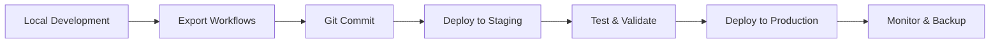

# n8n Professional Installation Suite

[](https://n8n.io/)
[](https://ubuntu.com/server)
[](https://docs.docker.com/)
[](https://docs.ansible.com/)
[](https://detalex.de/)

A comprehensive, production-ready n8n installation and management suite designed for professional multi-environment deployments.

## Why This Suite?

**Direct n8n development is challenging in professional environments:**
- ❌ No built-in multi-environment management
- ❌ Complex credential handling across stages
- ❌ Manual deployment processes prone to errors
- ❌ Limited backup and disaster recovery options
- ❌ No enterprise-grade security configurations

**This suite solves these problems with:**
- ✅ Automated multi-environment workflows (Dev → Staging → Production)
- ✅ Secure credential management with Ansible Vault
- ✅ One-command installations and deployments
- ✅ Complete backup/restore automation
- ✅ Production-ready security configurations
- ✅ Git-integrated workflow versioning

## Quick Links

📖 **[Complete Documentation](documentation/)** - Detailed guides and setup instructions
🔧 **[Installation Scripts](scripts/)** - All management and deployment tools

## Quick Start

```bash
# Clone the repository
git clone https://github.com/Hammdie/n8n-install.git
cd n8n-install

# Run installation (requires root)
sudo ./scripts/deployment/install-n8n.sh

# Access management menu
./scripts/management/n8n-menu.sh
```

## Documentation Overview

| Document | Description |
|----------|-------------|
| [📖 **Main Guide**](documentation/README.md) | Complete installation and setup guide |
| [🏗️ **Features Overview**](documentation/FEATURES.md) | Technical specifications and capabilities |
| [🌍 **Multi-Environment**](documentation/MULTI-ENVIRONMENT.md) | Professional development workflow guide |
| [📋 **Navigation Index**](documentation/INDEX.md) | Quick navigation to all features and scripts |

## Architecture Highlights

### 🏢 **Multi-Environment Support**
- **Development**: localhost + Git integration
- **Pre-Production**: Staging servers for testing
- **Production**: Secure, automated deployments

### 🐳 **Flexible Installation Options**
- **Native Installation**: Node.js + PostgreSQL + systemd
- **Docker Compose**: Containerized with automated SSL
- **Hybrid Support**: Mix approaches per environment

### 🔒 **Enterprise Security**
- Ansible Vault for credential encryption
- Automatic SSL certificate management
- Security headers and firewall configuration
- Encrypted backup solutions

### ⚙️ **Professional Management**
- Interactive management menus
- Automated backup and restore
- Git-based workflow versioning
- Multi-server deployment automation

## Script Categories

| Category | Purpose | Example Use |
|----------|---------|-------------|
| [🚀 **deployment**](scripts/deployment/) | Installation & Setup | Fresh server installations |
| [🖥️ **host**](scripts/host/) | System Maintenance | Backups, updates, user management |
| [⚙️ **management**](scripts/management/) | Daily Operations | Interactive menus and status |
| [📋 **workflows**](scripts/workflows/) | Data Management | Export/import between environments |
| [🐳 **docker**](scripts/docker/) | Container Management | Docker Compose operations |

## Development Workflow

The suite supports a complete development-to-production pipeline:



Use `./scripts/deployment/setup-development.sh` to create isolated development environments.

## Support & Contributing

- **Issues**: Report bugs and feature requests
- **Documentation**: Comprehensive guides in [documentation/](documentation/)

## License

This project is designed for professional n8n deployments. See individual component licenses for details.

---

**Ready to deploy n8n professionally?** Start with the [Complete Documentation](documentation/README.md) or jump straight to [Installation](scripts/deployment/install-n8n.sh).